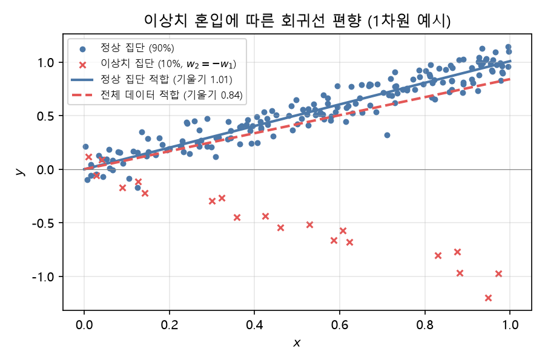
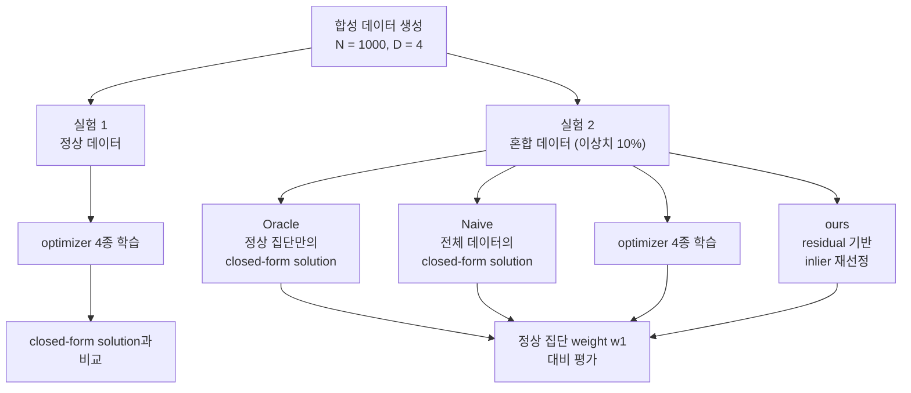
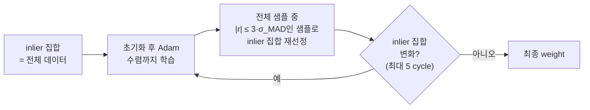
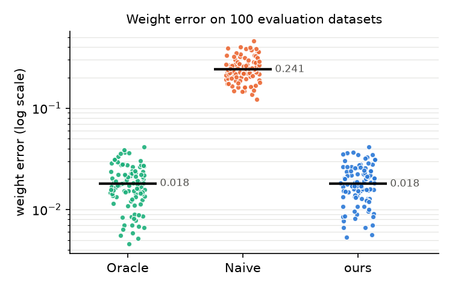

# 이상치가 선형 회귀와 경사 기반 최적화에 미치는 영향

## 개요

본 프로젝트는 선형 회귀에서 이상치(outlier)가 경사 기반 최적화의 해에 미치는
영향을 분석하고, residual 기반의 반복적인 inlier 재선정으로 정상 집단의 weight를
복원하는 방법(`ours`)을 제안하고 평가한다.

데이터는 두 집단의 혼합으로 구성된다. 각 샘플은 확률 0.9로 weight `w1`을 따르는 정상
집단에, 확률 0.1로 부호가 반전된 `w2 = -w1`을 따르는 이상치 집단에 속한다. 그림 1은 입력이
1차원인 경우의 예시이다(점 200개 중 이상치 20개, 실제 기울기 1). 정상 집단만으로
최소제곱 적합을 하면 기울기는 1.01이지만, 이상치를 포함한 전체 데이터로 적합하면
0.84로 편향된다.

  

*그림 1. 이상치 혼입에 따른 회귀선 편향(1차원 예시, 설명용 합성 데이터).*

모든 optimizer(GD, AdaGrad, RMSProp, Adam)와 closed-form solution은 scikit-learn이나
autograd 없이 NumPy로 직접 구현하였다. 방법의 개발 과정은
[`docs/experiment-log.md`](docs/experiment-log.md)에 기록한다.

## 실험 내용

### 실험 설정

- **데이터:** `X ~ U[0,1)^{1000×4}`, `y = Xw + ε`, `ε ~ 0.1·N(0, 1)`. 실제
  weight(`w_true`, `w1`)는 데이터셋마다 `U[0,1)^4`에서 뽑는다.
- **혼합 데이터(실험 2):** 각 샘플은 확률 0.9로 `w1`을, 0.1로 `w2 = -w1`을 따른다.
- **데이터셋과 seed:** 데이터셋 하나는 seed 하나로 정해진다. seed는 `X`, 실제 weight,
  노이즈, 각 샘플의 이상치 여부를 결정한다. 학습의 초기 weight는 모든 실행에서
  seed 0으로 생성한다.
- **데이터셋 구분:** 방법의 개발과 선택에는 `seed=0–140`의 데이터셋을 사용하였다.
  최종 평가는 이와 겹치지 않는 `seed=141–240`의 데이터셋 100개(이상치 81–123개)에서
  한 번 수행하였으며, 이 데이터셋은 다른 용도로 사용하지 않았다.
- **epoch:** 파라미터 갱신 1회를 뜻한다. full batch는 전체 데이터, mini-batch는 샘플
  32개, SGD는 샘플 1개로 한 번 갱신한다.
- **평가 지표:**
  - **weight error** `‖ŵ − w_ref‖₂`: 주 지표. `w_ref`는 실험 1에서 `w_true`, 실험 2에서
    정상 집단의 `w1`이다.
  - **MSE**: 실험 1에서만 사용한다. optimizer의 MSE는 마지막 epoch에서 갱신 직전의
    예측으로 구한 해당 batch의 평균 제곱 오차이고(full batch에서는 전체 데이터의 학습
    MSE), closed-form solution의 MSE는 전체 데이터의 평균 제곱 오차이다.
- **표기:** residual은 `r = Xŵ − y`이다. 샘플의 노이즈는 `ε = y − x·w`이며, `w`는 그
  샘플이 속한 집단의 실제 weight(`w1` 또는 `w2`)이다. 표준편차는 모집단 표준편차이다.

실험 구성은 그림 2와 같다.

*그림 2. 실험 구성.*

### 실험 1: 정상 데이터에서의 optimizer 비교

이상치가 없는 데이터에서 네 optimizer가 closed-form solution에 수렴하는지
검증한다. 이후 실험에서 사용할 optimizer 구현의 정확성을 확인하는 기준 실험이다.

- optimizer 4종 × init 3종 × batch 3종(`full`, `mini-batch` 32, `SGD`)의 전체 조합.
  init은 `random`(`N(0, 1)`), `zero`(전부 0), `sparse`(`N(0, 1)`에서 약 80%를 0으로)이다.
- learning rate 0.1, 1000 epoch
- closed-form solution은 정규방정식 `(XᵀX)⁻¹Xᵀy`로 구한다.
- 이상치가 없는 정상 데이터셋 1개(`seed=0`)에서 수행한다.

### 실험 2: 혼합 데이터에서의 이상치 영향

다음 네 조건을 비교한다.

1. **Oracle:** 집단 label `z`를 이용해 정상 집단만으로 구한 closed-form
   solution(pseudo-inverse). 실제로는 `z`를 알 수 없으므로 비교 기준으로 사용한다. 개별
   데이터셋에서는 다른 방법이 더 작은 오차를 보일 수 있다.
2. **Naive:** 전체 데이터에 대한 closed-form solution(pseudo-inverse). 이상치를
   처리하지 않은 기준선이다.
3. **optimizer grid:** 실험 1과 같은 36개 조합(learning rate 0.01, 1000 epoch). 모든
   optimizer는 전체 데이터의 MSE라는 같은 볼록 손실을 최소화하므로, 수렴하면 Naive
   해에 도달한다. optimizer 선택만으로 이상치의 영향이 줄어드는지 확인한다.
4. **`ours`:** 제안 방법.

### 제안 방법: `ours`

이상치 집단은 정상 집단과 반대 규칙을 따르므로, 적합된 모델에 대해 큰 residual을
가질 것으로 가정한다. `ours`는 full-batch Adam 학습과 inlier 집합의 재선정을 cycle
단위로 반복한다(그림 3).

1. weight와 optimizer 상태를 초기화하고, 현재 inlier 집합으로 Adam을 gradient
   norm이 `1e-5` 미만이 될 때까지 학습한다(cycle당 최대 20000 epoch). 첫 cycle의
   inlier 집합은 전체 데이터이다.
2. 현재 inlier의 residual로 robust scale
   `σ_MAD = 1.4826 · median(|r − median(r)|)`를 구한다.
3. **전체 샘플**의 residual을 계산하여, `|r| ≤ 3·σ_MAD`인 샘플을 새 inlier 집합으로
   정한다. 이전 cycle에서 제외된 샘플도 이 조건을 만족하면 다시 포함된다.
4. inlier 집합이 이전과 같으면 종료하고, 다르면 1로 돌아간다. 학습은 최대 5 cycle이며,
   5번째 cycle 뒤에는 재선정하지 않고 종료한다.

*그림 3. `ours`의 학습 절차.*

첫 cycle의 적합은 이상치의 영향을 받아 편향되어 있으므로, 이때 제외된 정상 샘플은
residual 분포의 한쪽 꼬리에 몰린다. `ours`는 제외를 영구적으로 두지 않고 매 cycle
전체 샘플에서 inlier를 다시 선정하여 이 편향을 줄인다. 평가 데이터셋 100개에서 첫
cycle 뒤 제외된 정상 샘플은 노이즈가 양수인 샘플 3482개, 음수인 샘플 33개였으나,
최종적으로 제외된 정상 샘플은 양수 129개, 음수 126개이다. `σ_MAD`는 MAD 기반
추정량으로, 최종 cycle의 값은 평균 0.0994(범위 0.0888–0.1129)로 실제 노이즈 표준편차
0.1에 가깝다.

*표 1. `ours`의 설정값.*

| 항목 | 값 | 근거 |
| --- | --- | --- |
| 재선정 기준 `k`(`k·σ_MAD`) | 3 | 관례적인 3σ 기준. 다른 값은 시험하지 않았다 |
| 수렴 기준(gradient norm) | `1e-5` | 개발 단계에서 선택. `seed=0`의 비교(로그 E3)에서 `1e-4`–`1e-6`의 pruning 결정이 같았다 |
| 최대 cycle 수 | 5 | 개발 단계에서 고정(로그 E3) |
| cycle당 최대 epoch | 20000 | 수렴 기준이 먼저 적용되도록 크게 둔 상한 |
| learning rate | 0.1 | 개발 단계에서 선택(로그 E3) |
| 초기 weight | `N(0, 1)`, seed 0 | 모든 cycle에서 재초기화 |
| Adam | `β1 = 0.9`, `β2 = 0.999`, `ε = 1e-8` | 표준값 |

설정값은 모두 최종 평가 전에 정하였다. 최종 평가에서 한 cycle에 필요한 epoch는 최대
242였고, learning rate를 0.01, 0.5로 바꾸어도 평균 weight error는 같았다(요약 4).

구현은 `src/outlier_regression/outlier_removal.py`의 `ours(X, y, w_ref)`이며, 기본
설정값은 표 1과 같다.

## 결과

### 요약

1. 정상 데이터의 `init=zero`, `batch=full` 설정에서 GD, AdaGrad, Adam은 closed-form
   solution(weight error 0.0236)에 수렴한다.
2. 10%의 이상치만으로 Naive 해의 weight error는 Oracle의 약 13.2배(평균 0.0188 →
   0.2478)로 증가한다. optimizer grid에서 수렴한 조건은 Naive 해에 도달하며, 36개
   조합 중 평균 weight error가 0.1882보다 작은 조합은 없다.
3. `ours`는 평가 데이터셋 100개 모두에서 Naive보다 작은 weight error를 보이며, 평균
   weight error를 0.0188로 Naive 대비 92.4% 줄인다. Oracle과의 평균 차이는 +0.00003으로
   통계적으로 유의하지 않다.
4. `ours`의 결과는 learning rate에 거의 영향을 받지 않는다. learning rate 0.01, 0.1,
   0.5에서 평균 weight error는 모두 0.0188이며, 데이터셋별 차이는 최대 0.0015이다.

### 실험 1: 정상 데이터

closed-form solution의 weight error는 **0.0236**, MSE는 **0.0103**이다.

표 2는 `init=zero`, `batch=full` 설정의 결과이며, 그림 4는 같은 설정에서의 학습
곡선이다(전체 조합은
[`results/baseline/optimizer_grid.csv`](results/baseline/optimizer_grid.csv)).

*표 2. 정상 데이터에서의 optimizer별 결과(`init=zero`, `batch=full`).*

| optimizer | MSE | weight error |
| --- | --- | --- |
| GD | 0.01028 | 0.02362 |
| AdaGrad | 0.01028 | 0.02362 |
| RMSProp | 0.02108 | 0.10608 |
| Adam | 0.01028 | 0.02362 |

GD, AdaGrad, Adam은 closed-form solution과 같은 값에 수렴한다. RMSProp은 learning
rate 0.1에서 진동하며 closed-form solution에 도달하지 않는다
([`results/baseline/convergence_tail.json`](results/baseline/convergence_tail.json)).

| MSE | weight error |
| --- | --- |
|  |  |

*그림 4. `init=zero`, `batch=full` 설정에서 정상 데이터의 epoch별 MSE(좌)와 weight
error(우).*

### 실험 2: 혼합 데이터

표 3과 그림 5는 평가 데이터셋 100개(`seed=141–240`)에서의 결과이다
([`results/evaluation/`](results/evaluation/)).

*표 3. 평가 데이터셋 100개에서의 weight error. optimizer grid는 learning rate 0.01,
`ours`는 learning rate 0.1의 결과이다.*

| 방법 | weight error(평균 ± 표준편차) | 최소–최대 |
| --- | --- | --- |
| Oracle | 0.0188 ± 0.0082 | 0.0046–0.0415 |
| Naive | 0.2478 ± 0.0674 | 0.1218–0.4573 |
| optimizer grid, Adam(`full`, `zero`) | 0.2478 ± 0.0674 | 0.1218–0.4573 |
| `ours` | 0.0188 ± 0.0078 | 0.0053–0.0414 |

  

*그림 5. 평가 데이터셋 100개에서의 방법별 weight error(log scale). 점 하나가
데이터셋 하나이며, 검은 막대와 숫자는 중앙값이다.*

- **optimizer grid:** full-batch Adam(`zero` 초기화)은 모든 데이터셋에서 Naive 해와
  0.00055 이내로 일치한다. 손실의 최솟값은 Naive 해 하나뿐이므로, Naive와 다른 값을
  보이는 조합은 1000 epoch 안에 최솟값에 도달하지 못한 경우이다. 36개 조합 중 평균
  weight error가 가장 작은 조합도 0.1882이다(전체 조합은
  [`results/evaluation/summary.json`](results/evaluation/summary.json)). optimizer
  선택만으로는 이상치의 영향이 제거되지 않는다.
- **Oracle과의 비교:** `ours`와 Oracle의 평균 weight error 차이는 +0.00003이며,
  통계적으로 유의하지 않다(95% bootstrap 신뢰구간 [−0.00044, +0.00049], 양측
  sign-flip 검정 p = 0.895). 100개 중 49개에서는 `ours`의 weight error가 Oracle보다
  작다. Oracle은 정상 샘플을 모두 사용하는 반면, `ours`는 residual이 `3·σ_MAD`를 넘는
  정상 샘플(평균 2.55개)을 제외하고 residual이 작은 일부 이상치를 포함한다. 두 해는
  서로 다른 샘플 집합에 대한 최소제곱 해이므로, 개별 데이터셋에서의 우열은 두 집합의
  차이에 따라 달라진다.
- **남긴 샘플:** `ours`가 최종적으로 남긴 정상 샘플은 평균 896.25개로, 정상 샘플(평균
  898.8개)의 99.7%이다.

### 한계

- residual이 `3·σ_MAD` 이내인 이상치는 제거되지 않는다. 평가 데이터셋 100개 중 24개에서
  이상치가 남았으며(총 35개), 이들은 `x·w1`이 작아 회귀면 근처에 놓인 샘플이다. 남은
  이상치의 `x·w1`은 평균 0.155(최대 0.225)로, 제거된 이상치의 평균 1.004보다 작다. 최종
  inlier 집합을 closed-form으로 다시 적합할 때 남은 이상치를 제외하면, 포함했을 때와
  비교해 weight error가 최대 0.0030 달라진다.
- 평가 데이터셋 100개 중 11개는 5 cycle 안에 inlier 집합이 더 이상 바뀌지 않음을
  확인하지 못하였다. 최대 cycle을 20으로 늘려 확인한 결과, 9개는 5번째 cycle 이후
  집합이 바뀌지 않아 결과가 같았다. 나머지 2개(`seed=169`, `seed=232`)는 각각 6번째,
  7번째 cycle을 마친 뒤에 집합이 고정되었으며, weight error는 0.0108에서 0.0094로,
  0.0350에서 0.0355로 달라진다.
- 재선정 기준 `k`는 3만 사용하였으며, 다른 값에서의 결과는 확인하지 않았다.

### 후속 연구

본 실험은 부호가 반전된 단일 이상치 집단(`w2 = -w1`)과 이상치 비율 10%에서만
수행하였다. 후속 연구로 다음 조건에서 `ours`의 유효성을 확인할 필요가 있다.

- **이상치 비율:** 10%보다 높은 비율에서의 inlier 선정 정확도와 `σ_MAD` 추정의
  안정성.
- **이상치 형태:** 정상 규칙에 가까운 이상치(`w2 ≈ w1`), 입력 공간 밖의 leverage
  point, heavy-tailed 노이즈 등, 이상치의 residual이 크다는 가정이 약해지는 경우.
- **최대 cycle 수:** 5 cycle 안에 수렴하지 않는 경우를 없애는 종료 조건.
