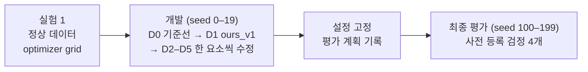
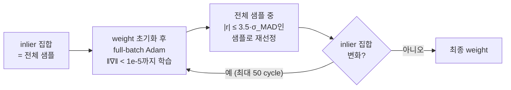
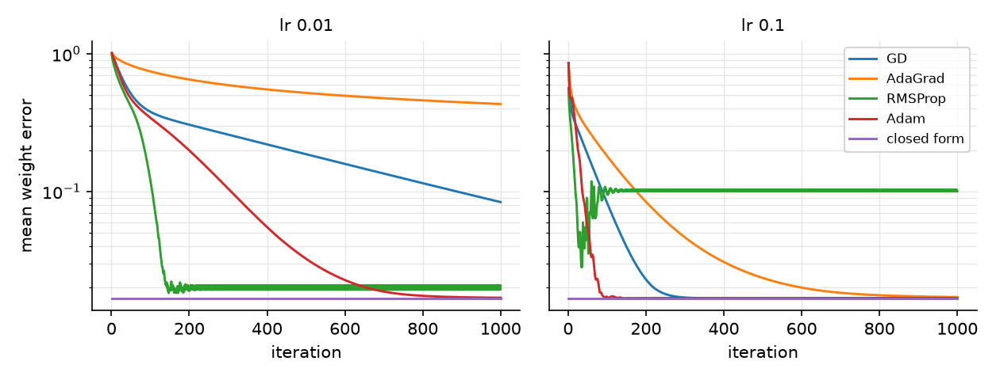
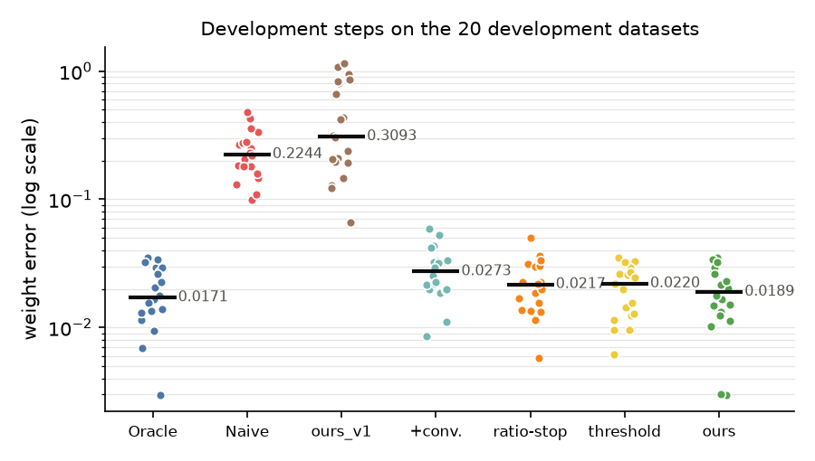
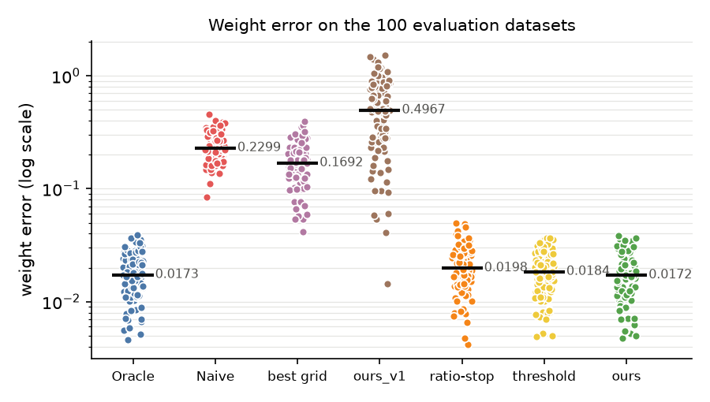

# 이상치가 선형 회귀와 경사 기반 최적화에 미치는 영향

## 개요

선형 회귀 데이터에 부호가 반전된 이상치 집단이 섞였을 때 경사 기반 최적화의 해가
받는 영향을 측정하고, residual 기반으로 inlier를 반복 재선정하여 정상 집단의 weight를
복원하는 방법(`ours`)을 개발·평가한다. 모든 optimizer와 closed-form solution은
NumPy로 직접 구현하였다. 모든 실행의 설정, 전체 결과 표, 판단 근거는
[`docs/experiment-log.md`](docs/experiment-log.md)(이하 로그)에 기록한다.

  

*그림 1. 이상치 혼입에 따른 회귀선 편향(1차원 예시). 정상 집단만의 기울기는 1.01,
전체 데이터의 기울기는 0.84이다.*

## 실험 설정

| 항목 | 내용 |
| --- | --- |
| 데이터 | `X ~ U[0,1)^{1000×4}`, `y = Xw + ε`, `ε ~ 0.1·N(0, 1)`, `w ~ U[0,1)^4` |
| 혼합 데이터 | 각 샘플이 확률 0.9로 `w1`(정상), 0.1로 `w2 = -w1`(이상치)을 따름 |
| 데이터셋 seed | 실험 1: 0–19, 개발: 0–19, 최종 평가: 100–199(최종 평가에만 사용) |
| 지표 | weight error `‖ŵ − w_ref‖₂`(`w_ref`: 실험 1은 `w_true`, 실험 2는 `w1`) |
| 기준선 | Oracle: 정상 샘플만의 closed-form solution, Naive: 전체 샘플의 closed-form solution |
| optimizer grid | GD, AdaGrad, RMSProp, Adam × batch(full, mini-batch 32, SGD) × init(random, zero, sparse) × lr(0.01, 0.1), 1000 iteration |
| 표기 | 소수점 넷째 자리까지 반올림 |

*그림 2. 실험 구성.*

## 제안 방법: `ours`

*그림 3. `ours`의 학습 절차. `σ_MAD = 1.4826 · median(|r − median(r)|)`는 현재
inlier의 residual `r = Xŵ − y`로 구한다.*

| 설정 | 값 | 결정 단계(로그) |
| --- | --- | --- |
| 수렴 기준 | `‖∇‖ < 1e-5` | D2 |
| learning rate | 0.1 | D2, D5 |
| 재선정 규칙 | readmit(매 cycle 전체 샘플에서 재선정) | D4 |
| `k` | 3.5 | D4 |
| 최대 cycle | 50 | D5 |

## 결과

### 실험 1: 정상 데이터

closed-form solution의 weight error는 0.0168 ± 0.0088이다(데이터셋 20개).

| optimizer (full batch, zero init) | lr 0.01 | lr 0.1 |
| --- | --- | --- |
| GD | 0.0838 | 0.0168 |
| AdaGrad | 0.4319 | 0.0171 |
| RMSProp | 0.0208 | 0.1006 |
| Adam | 0.0169 | 0.0168 |

  

*그림 4. 정상 데이터에서 iteration별 평균 weight error(full batch, zero init).*

### 개발 과정 (개발 데이터셋 20개)

| 단계 | 로그 | weight error(평균 ± 표준편차) | 중앙값 |
| --- | --- | --- | --- |
| Oracle | 기준 | 0.0194 ± 0.0093 | 0.0171 |
| Naive | 기준 | 0.2399 ± 0.0993 | 0.2244 |
| `ours_v1`(시작 방법) | D1 | 0.4664 ± 0.3472 | 0.3093 |
| + cycle별 수렴 | D2 | 0.0289 ± 0.0126 | 0.0273 |
| + 멈춤 규칙(ratio-stop) | D3 | 0.0229 ± 0.0102 | 0.0217 |
| threshold 제거, `k = 4` | D4 | 0.0210 ± 0.0088 | 0.0220 |
| readmit, `k = 3.5`(`ours`) | D4 | 0.0199 ± 0.0096 | 0.0189 |

  

*그림 5. 개발 단계별 데이터셋 weight error(log scale). 막대와 숫자는 중앙값이다.*

### 최종 평가 (평가 데이터셋 100개)

| 방법 | weight error(평균 ± 표준편차) | 중앙값 |
| --- | --- | --- |
| Oracle | 0.0186 ± 0.0081 | 0.0173 |
| Naive | 0.2441 ± 0.0679 | 0.2299 |
| optimizer grid 최선(RMSProp, SGD, zero, lr 0.01) | 0.1791 ± 0.0721 | 0.1692 |
| `ours_v1` | 0.5461 ± 0.3498 | 0.4967 |
| ratio-stop | 0.0215 ± 0.0095 | 0.0198 |
| threshold | 0.0191 ± 0.0081 | 0.0184 |
| **`ours`** | **0.0187 ± 0.0083** | **0.0172** |

*사전 등록 검정(`ours − B`, 양측 sign-flip 검정, Holm 보정).*

| B | 평균 차이 | 95% CI | `ours`가 작은 데이터셋 | p(Holm) |
| --- | --- | --- | --- | --- |
| Naive | -0.2254 | [-0.2392, -0.2121] | 100 / 100 | < 0.0001 |
| `ours_v1` | -0.5274 | [-0.5987, -0.4610] | 100 / 100 | < 0.0001 |
| ratio-stop | -0.0028 | [-0.0041, -0.0016] | 61 / 100 | 0.0001 |
| threshold | -0.0005 | [-0.0008, -0.0001] | 53 / 100 | 0.0129 |

  

*그림 6. 평가 데이터셋별 weight error(log scale). 막대와 숫자는 중앙값이다.*

- `ours − Oracle`의 평균은 0.0001(95% CI [-0.0002, 0.0004])이며, 100개 중
  49개에서 `ours`가 더 작다(검정하지 않은 기술 통계).
- `ours`의 평균은 lr 0.01, 0.1, 0.5에서 모두 0.0187이다.

## 한계

- 이상치는 `w2 = -w1` 한 형태, 비율 10%만 실험하였다.
- `ours`는 평가 데이터셋 100개 중 33개에서 이상치를 남겼다(총 55개).
- Huber loss, RANSAC 등 robust regression 기법과는 비교하지 않았다.

## 후속 연구

- 10%보다 높은 이상치 비율
- `w1`에 가까운 이상치, leverage point, heavy-tailed 노이즈
