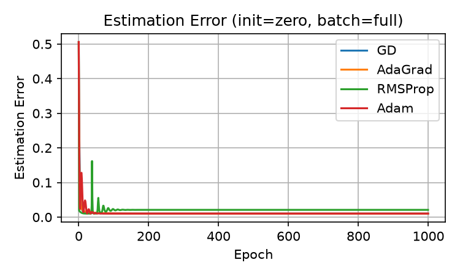
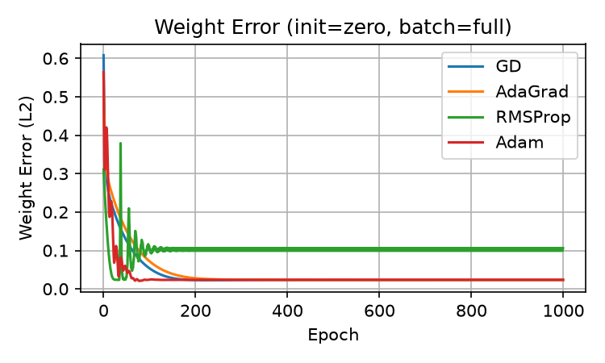
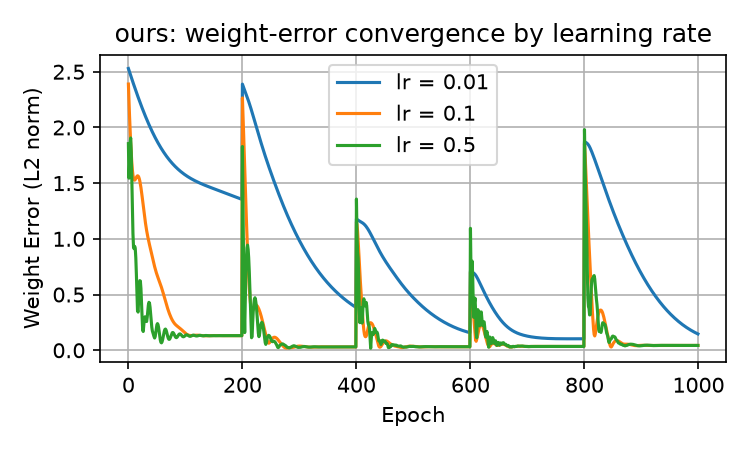

# Results

All numbers and figures below are produced by a single reproducible command
(no external data, fixed seeds):

```bash
python experiments/run_all.py
```

Artifacts are written under [`results/`](results/) and tracked in git so the
findings stay visible without re-running. Regenerating overwrites them
byte-for-similar (RNG streams are seeded; see `src/data.py`).

## 1. Baseline optimizer benchmark (clean data)

Synthetic linear data (`N=1000`, `D=4`, seed 0). Four hand-coded optimizers are
compared against the closed-form normal-equation solution.

**Closed-form reference** ([`results/baseline/closed_form.json`](results/baseline/closed_form.json)):

| metric | value |
| --- | --- |
| Weight error (L2) | 0.0236 |
| Estimation error (MSE) | 0.0103 |

**Optimizers at the best `(batch=full, init=zero)` configuration**
(full grid in [`results/baseline/optimizer_grid.csv`](results/baseline/optimizer_grid.csv)):

| Optimizer | Estimation error | Weight error (L2) |
| --- | --- | --- |
| GD | 0.01028 | 0.02362 |
| AdaGrad | 0.01028 | 0.02362 |
| RMSProp | 0.02108 | 0.10608 |
| Adam | 0.01028 | 0.02362 |

GD/AdaGrad/Adam recover the closed-form solution almost exactly; RMSProp lags
at this learning rate.

| Estimation error | Weight error |
| --- | --- |
|  |  |

## 2. Outlier study (two-population mixture)

A fraction `p=0.9` of samples follow the clean weights `w1`; the rest follow
`w2 = -w1` (outliers). Metrics in
[`results/outlier/summary.json`](results/outlier/summary.json).

| Fit | Estimation error (clean) | Weight error (L2) |
| --- | --- | --- |
| Oracle (clean population only) | 0.01015 | 0.02921 |
| Naive (all, contaminated) | 0.02742 | 0.13124 |
| `ours` (residual-cutoff + re-init, lr=0.01) | 0.01194 | 0.14898 |

The naive fit is pulled well off the clean solution by the outlier population
(weight error 0.131 vs. the oracle's 0.029). The periodic residual-cutoff
method recovers the clean MSE (0.012) while its weight error remains sensitive
to learning rate — see the sweep below.



*Learning-rate sweep of `ours` (weight-error convergence).*
